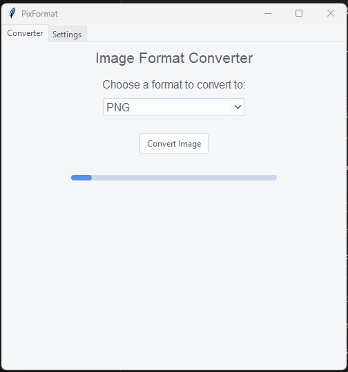
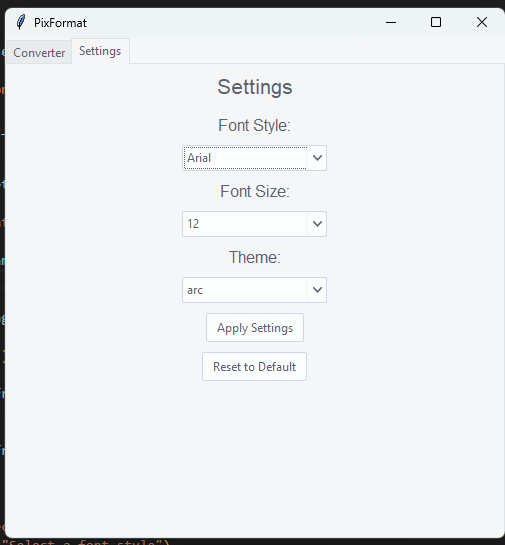
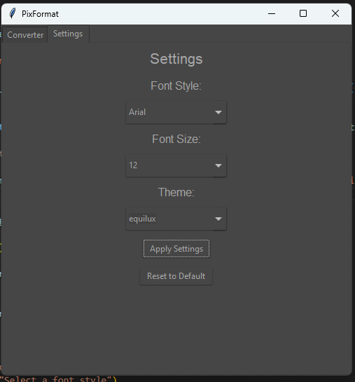

# PixFormat - Image Format Converter

PixFormat is a simple and efficient tool to convert images between various formats. It provides a user-friendly GUI built with `Tkinter` and supports formats like PNG, JPG, BMP, GIF, and more. The app also features settings for customizing font style, font size, and theme, enhancing the user experience.

## Features

- **Image Conversion**: Convert images between popular formats (PNG, JPEG, BMP, GIF, TIFF, etc.).
- **Progress Bar**: Visual indicator during the image conversion process.
- **Settings Panel**: Customize the app's font style, font size, and theme.
- **Tooltips**: Hover over UI elements to view helpful tooltips explaining their functionality.
- **Reset to Default**: Reset all settings to their default values with a single click.
- **Error Handling**: User-friendly error messages when conversion fails.

## Installation

### Prerequisites
- Python 3.6 or higher
- Tkinter library (usually pre-installed with Python)
- Pillow (for image processing)
- ttkthemes (for theming support)

### Install Dependencies
You can install the required dependencies using `pip`:

```bash
pip install Pillow ttkthemes
```

## Usage

1. Clone this repository to your local machine:

```bash
git clone https://github.com/sheekovic/PixFormat.git
```

2. Navigate to the project directory:

```bash
cd PixFormat
```

3. Run the application:

```bash
python main.py
```

## Features

### Image Conversion
- Select an image to convert.
- Choose the target format (PNG, JPG, BMP, etc.).
- The progress bar will show the conversion status.
- Save the converted file to the desired location.

### Settings
- Customize the font style and size.
- Choose your preferred theme from a list of available themes.
- Apply or reset settings to default values with ease.

### Tooltips
- Hover over settings options or buttons to get helpful descriptions of their functionality.

## Screenshots






## Contributing

Contributions are welcome! If you find a bug or want to add a feature, feel free to open an issue or submit a pull request.

## Credits

- [Sheekovic](https://github.com/sheekovic)

## License

This project is licensed under the MIT License - see the [LICENSE](LICENSE) file for details.

## Acknowledgments

- Pillow: Python Imaging Library (PIL) Fork
- ttkthemes: Themed widgets for Tkinter